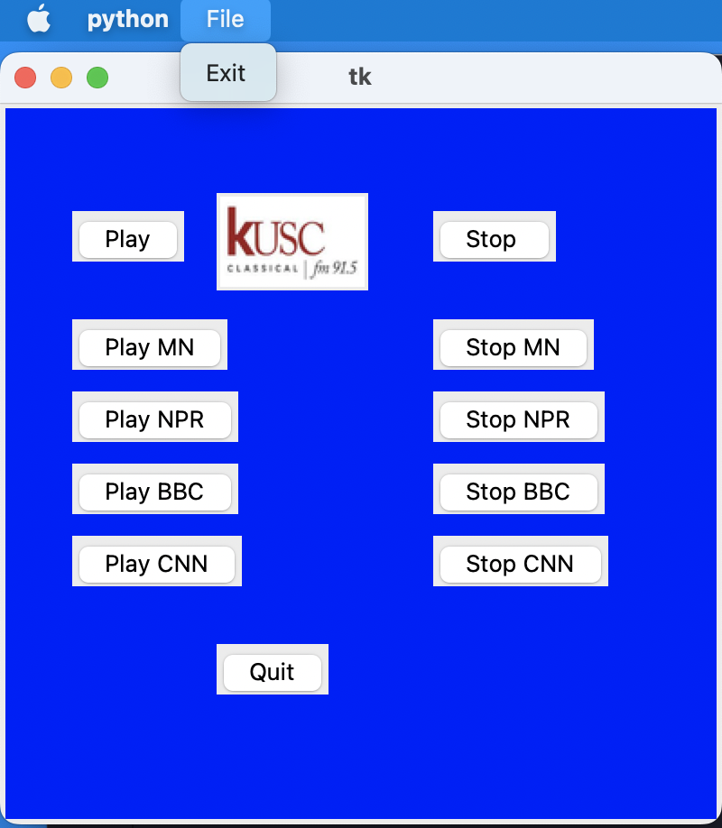

# Python Custom Streaming Media Player App
### This Custom Streaming Media Player App uses Selenium to webscrape online media players and interact with their respective play and stop buttons to be able to select, play and stop whichever radio station desired.
* KUSC Classical Music from KUSC.org
* Classical Music from YourClassical.org
* NPR station from RadioStationUSA.fm
* BBC station from RadioStationUSA.fm
* CNN station from RadioStationUSA.fm
### The Custom Streaming Media Player App uses TKinter to create the GUI and includes:
* Play and Stop buttons for each station
* A top file menu with Exit to exit the app
* A Quit Button on the interface to stop the player

Note: Current changes being done are only to aesthetics of the GUI, as the media player functionality is already in place. Only certain aspects of the GUI are currently undergoing changes, such as the background, colors, images.

Here's a screenshot of the current GUI: A work in progress.

Screenshot of GUI will be updated as changes are made.